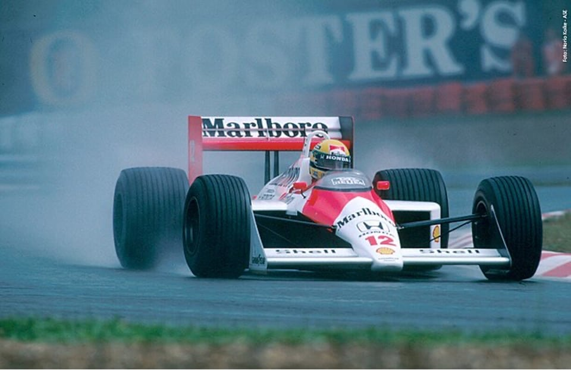

<!--
  README — Hyan Schibelsky
  Inspirado em github.com/Glauedson
-->

<!-- BANNER -->

<!-- SENNA QUOTE -->

 

*"No que diz respeito ao empenho, ao compromisso, ao esforço, à dedicação, não existe meio-termo. Ou você faz uma coisa bem-feita ou não faz."*

**Ayrton Senna**

<!-- STATS -->

  
  

 

<!-- WHO AM I -->
<table>
<tr>
<td width="240px">

</td>
<td>

**Who Am I?**

Cloud Engineer. Trabalho com **Kubernetes**, **Terraform**, **CI/CD** e **AWS** no Agibank.

Crio conteúdo DevOps no **[@hyansky.devops](https://www.instagram.com/hyansky.devops/)** e desenvolvo projetos legais nas horas vagas. Fã de motorsport.

**AWS Certified Cloud Practitioner** · Fatec Campinas · Próximo: SAA

</td>
</tr>
</table>

<!-- LINKS -->

  <strong>Vamos conversar?</strong>
   

  
  
  

 

<!-- OUROBOROS -->

<pre style="font-size:6px; line-height:1.1; text-align:center;">
⠀⠀⠀⠀⠀⠀⠀⢀⣠⣤⣶⣶⣿⣿⣿⣿⣿⣷⣶⣦⣄⡀⠀⠀⠀⠀⠀⠀⠀⠀⠀⠀⠀⠀⠀⠀⠀⠀⠀⠀⣀⣤⣶⣶⡿⠿⢿⣿⣶⣶⣤⣄⡀⠀⠀⠀⠀⠀⠀⠀
⠀⠀⠀⠀⠀⣠⣶⣿⣿⣿⣿⣿⣿⣿⣿⣿⣿⣿⣿⣿⣿⣿⣷⣄⡀⠀⠀⠀⠀⠀⠀⠀⠀⠀⠀⠀⠀⠀⠠⠞⠋⠉⠀⠀⠀⠀⠀⠀⠀⠉⠛⢿⣿⣷⣄⠀⠀⠀⠀⠀
⠀⠀⠀⣠⣾⣿⣿⣿⣿⠿⠛⠉⠁⠀⠀⠀⠀⠉⠙⠻⢿⣿⣿⣿⣿⣄⠀⠀⠀⠀⠀⠀⠀⠀⣀⣴⣶⣆⠀⠀⠀⠀⠀⠀⠀⠀⠀⠀⠀⠀⠀⠀⠈⠻⣿⣷⣄⠀⠀⠀
⠀⠀⣼⣿⣿⣿⡿⠋⠁⠀⠀⠀⠀⠀⠀⠀⠀⠀⠀⠀⠀⠙⢿⣿⣿⣿⣷⡀⠀⠀⠀⢀⣶⣿⣿⣿⣿⠏⠀⠀⠀⠀⠀⠀⠀⠀⠀⠀⠀⠀⠀⠀⠀⠀⠘⣿⣿⣧⠀⠀
⠀⣼⣿⣿⣿⡟⠀⠀⠀⠀⠀⠀⠀⠀⠀⠀⠀⠀⠀⠀⠀⠀⠀⠙⣿⣿⣿⣿⣄⠀⠀⣿⣿⣿⣿⣿⡟⠀⠀⠀⠀⠀⠀⠀⠀⠀⠀⠀⠀⠀⠀⠀⠀⠀⠀⠘⣿⣿⣧⠀
⢸⣿⣿⣿⡟⠀⠀⠀⠀⠀⠀⠀⠀⠀⠀⠀⠀⠀⠀⠀⠀⠀⠀⠀⠈⢿⣿⣿⣿⢂⣾⣿⣿⣿⠿⠛⠀⠀⠀⠀⠀⠀⠀⠀⠀⠀⠀⠀⠀⠀⠀⠀⠀⠀⠀⠀⢸⣿⣿⡄
⣿⣿⣿⣿⠁⠀⠀⠀⠀⠀⠀⠀⠀⠀⠀⠀⠀⠀⠀⠀⠀⠀⠀⠀⠀⠀⢻⡿⢡⣿⣿⣿⡿⠃⠀⠀⠀⠀⠀⠀⠀⠀⠀⠀⠀⠀⠀⠀⠀⠀⠀⠀⠀⠀⠀⠀⠈⣿⣿⡇
⣿⣿⣿⣿⠀⠀⠀⠀⠀⠀⠀⠀⠀⠀⠀⠀⠀⠀⠀⠀⠀⠀⠀⠀⠀⠀⠀⣱⣿⣿⣿⡿⡁⠀⠀⠀⠀⠀⠀⠀⠀⠀⠀⠀⠀⠀⠀⠀⠀⠀⠀⠀⠀⠀⠀⠀⢠⣿⣿⡇
⢿⣿⣿⣿⡄⠀⠀⠀⠀⠀⠀⠀⠀⠀⠀⠀⠀⠀⠀⠀⠀⠀⠀⠀⠀⠀⣼⣿⣿⣿⡟⣴⣿⣦⠀⠀⠀⠀⠀⠀⠀⠀⠀⠀⠀⠀⠀⠀⠀⠀⠀⠀⠀⠀⠀⠀⣸⣿⣿⡇
⠸⣿⣿⣿⣷⠀⠀⠀⠀⠀⠀⠀⠀⠀⠀⠀⠀⠀⠀⠀⠀⠀⠀⠀⢀⣾⣿⣿⣿⠏⢸⣿⣿⣿⣷⡀⠀⠀⠀⠀⠀⠀⠀⠀⠀⠀⠀⠀⠀⠀⠀⠀⠀⠀⠀⣰⣿⣿⣿⠁
⠀⢻⣿⣿⣿⣷⡀⠀⠀⠀⠀⠀⠀⠀⠀⠀⠀⠀⠀⠀⠀⠀⠀⣠⣿⣿⣿⡿⠃⠀⠀⠹⣿⣿⣿⣿⣆⠀⠀⠀⠀⠀⠀⠀⠀⠀⠀⠀⠀⠀⠀⠀⠀⠀⣴⣿⣿⣿⠃⠀
⠀⠀⠹⣿⣿⣿⣿⣦⡀⠀⠀⠀⠀⠀⠀⠀⠀⠀⠀⠀⢀⣠⣾⣿⣿⣿⠟⠁⠀⠀⠀⠀⠈⢻⣿⣿⣿⣷⣄⡀⠀⠀⠀⠀⠀⠀⠀⠀⠀⠀⠀⢀⣠⣾⣿⣿⡿⠃⠀⠀
⠀⠀⠀⠈⠻⣿⣿⣿⣿⣶⣤⣀⣀⠀⠀⠀⣀⣀⣤⣶⣿⣿⣿⣿⡿⠁⠀⠀⠀⠀⠀⠀⠀⠀⠙⢿⣿⣿⣿⣿⣶⣤⣀⣀⠀⠀⠀⢀⣀⣤⣶⣿⣿⣿⣿⠟⠁⠀⠀⠀
⠀⠀⠀⠀⠀⠈⠛⢿⣿⣿⣿⣿⣿⣿⣿⣿⣿⣿⣿⣿⣿⡿⠟⠁⠀⠀⠀⠀⠀⠀⠀⠀⠀⠀⠀⠀⠈⠻⢿⣿⣿⣿⣿⣿⣿⣿⣿⣿⣿⣿⣿⣿⡿⠛⠁⠀⠀⠀⠀⠀
⠀⠀⠀⠀⠀⠀⠀⠀⠈⠉⠛⠻⠿⠿⠿⠿⠿⠟⠛⠉⠁⠀⠀⠀⠀⠀⠀⠀⠀⠀⠀⠀⠀⠀⠀⠀⠀⠀⠀⠉⠛⠻⠿⢿⣿⣿⣿⠿⠿⠟⠋⠁⠀⠀⠀⠀⠀⠀⠀⠀
</pre>

*Ouroboros — a serpente que devora a própria cauda.*

*Presente no túmulo de Tutancâmon, na mitologia nórdica e na alquimia grega,*
*cada cultura o usou para simbolizar algo diferente. Mas o núcleo permanece:*

*um processo que, feito corretamente, leva ao renascimento e à melhoria.*
*Feito incorretamente, leva à destruição.*

*No DevOps, chamamos esse processo de pipeline.*

 

<!-- CONTRIBUIÇÕES -->

### Contribuições

 

 

<!-- STACK + STATS -->
<table align="center">
<tr>
<td valign="top" width="50%">

### Stack

**Cloud & DevOps**

  

**Linguagens & Scripting**

  

**Outros que já usei**

 

</td>
<td valign="top" width="50%">

### Streak

### Certificações

</td>
</tr>
</table>

 

---

  Feito com muito <code>kubectl apply</code>

